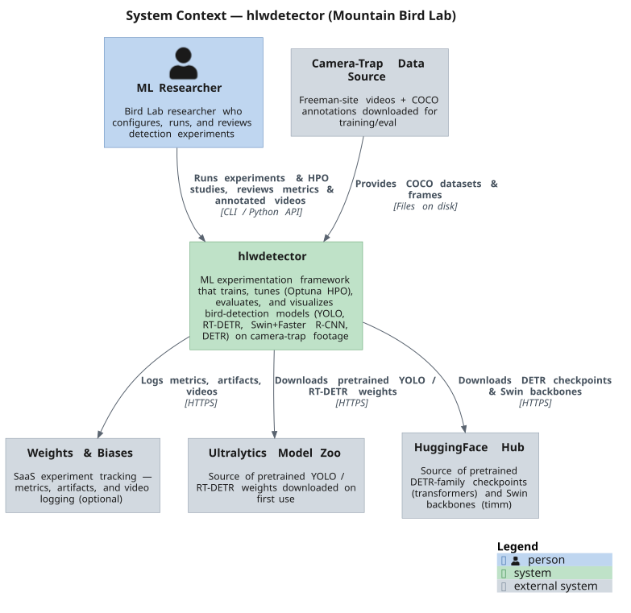
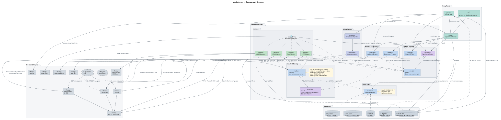
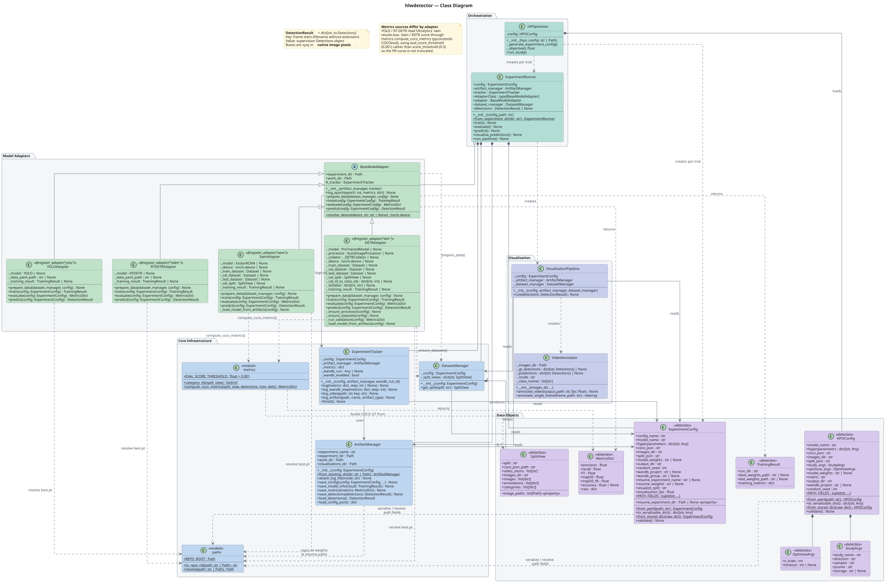

# Freeman Bird Detection: HLW Detector

A framework for running and comparing bird detection experiments on camera trap footage. Supports multiple detection models through a unified adapter interface, with experiment tracking, artifact management, and visualization.

## Repository Structure

```
freeman-bird-detection/
├── hlwdetector/          # Core experiment framework
├── configs/              # YAML experiment configurations
├── data/                 # Datasets (h03, h23)
├── outputs/              # Experiment artifacts and results
├── utilities/            # Data preparation and annotation conversion tools
├── notebooks/            # Dataset prep and tutorial notebooks
├── docs/                 # Architecture diagrams (PlantUML)
├── run_experiments.py    # Example experiment runner script
└── run_experiments.ipynb # Interactive experiment notebook
```

## Architecture

The diagrams below are rendered automatically from the PlantUML sources in `docs/diagrams/`. Edit the `.puml` files — a GitHub Action ([`render-puml.yml`](.github/workflows/render-puml.yml)) re-renders the SVGs on every push, so do not edit the `.svg` files by hand.

### System Context



### Components



### Class Diagram



## Prerequisites

1. Install dependencies:
```bash
pip install -r requirements.txt
```

2. Ensure you have the following inputs ready:
   - A COCO-format annotation JSON (e.g. `instances_merged.json`)
   - A split JSON mapping split names to video stems (see format below)
   - Extracted frame images in a single flat directory (`images_dir`)

If you need to extract frames from raw videos:
```python
from pathlib import Path
from utilities.video_dataset_prep_tools import extract_frames_from_dir

extract_frames_from_dir(
    video_dir=Path("/path/to/videos"),
    out_dir=Path("data/h23/images"),
)
```

The `split.json` file maps split names to lists of video stems. The framework filters images at runtime by matching each frame's filename prefix against the listed stems:
```json
{
  "train": ["video_001", "video_002"],
  "val":   ["video_003"],
  "test":  ["video_004"]
}
```

---

## Defining a Config

Create a YAML file in `configs/`. All paths are resolved relative to the YAML file's location:

```yaml
config_name: yolo11_h23
model_name: yolo

hyperparameters:
  model_weights: yolo11n.pt
  epochs: 100
  imgsz: 640
  batch: 32
  device: "0"

coco_json: ../data/h23/instances_merged.json
split_json: ../data/h23/split.json
images_dir: ../data/h23/images
output_dir: ../outputs

wandb_project: freeman-bird-detection
visualize_split: test
```

**Key config fields:**
- `config_name` — used for naming output directories
- `model_name` — which adapter to use (`"yolo"` or `"rtdetr"`)
- `hyperparameters` — model-specific training parameters passed through to the adapter (e.g. `model_weights`, `epochs`, `imgsz`, `batch`, `device`)
- `coco_json` — COCO-format annotation JSON for all frames
- `split_json` — JSON defining the train/val/te`1st video stems
- `images_dir` — flat directory containing the extracted video frames
- `output_dir` — base directory for experiment output (default `outputs`)
- `random_seed` — random seed (default `42`)
- `wandb_project` — optional Weights & Biases project name for logging
- `visualize_split` — which split to visualize after prediction (`"train"`, `"val"`, or `"test"`; default `"test"`)
- `visualization_fps` — frame rate of the annotated output video (default `29.0`)
- `resume_from` / `resume_experiment` — see [Resuming Training](#resuming-training) below

All path fields (`coco_json`, `split_json`, `images_dir`, `output_dir`, `resume_from`) are resolved relative to the YAML file's location.

---

## Running Experiments

Each experiment produces a timestamped output directory under `outputs/<config_name>_<timestamp>/` containing:
- `config.json` — full experiment configuration
- `model.json` — paths to best and last checkpoint weights
- `metrics.json` — evaluation results
- `detections.json` — per-frame inference results
- `visualizations/` — annotated output videos
- `experiment.log` — full run log

### Full Pipeline

Run all stages (train → evaluate → predict → visualize) in sequence using `run_pipeline()`:

```python
from hlwdetector.runner import ExperimentRunner

runner = ExperimentRunner("configs/yolo11_h23_full.yaml")
runner.run_pipeline()
```

### Running Stages Individually

Each stage can also be called separately. This is useful for re-running evaluation or visualization without retraining:

```python
from hlwdetector.runner import ExperimentRunner

runner = ExperimentRunner("configs/yolo11_h23_full.yaml")
runner.train()
runner.evaluate()
runner.predict()
runner.visualize_predictions()
```

### Attaching to an Existing Experiment

To run evaluation, prediction, or visualization on a previously completed experiment, use `ExperimentRunner.from_experiment_dir()`. This attaches to the existing output directory — no new timestamped directory is created, and all outputs are written back into the original run.

```python
from hlwdetector.runner import ExperimentRunner

runner = ExperimentRunner.from_experiment_dir("outputs/yolo11_h23_20260312_233336")
runner.evaluate()
runner.predict()
runner.visualize_predictions()
```

This requires that `config.json` and `model.json` are present in the experiment directory (i.e., training completed successfully).

### Resuming Training

To continue training from a prior checkpoint, set both `resume_from` and `resume_experiment` in the config. `resume_from` points to the model weights file; `resume_experiment` is the name of the original output directory. A new timestamped output directory is created for the resumed run.

```yaml
resume_experiment: yolo11_h23_20260402_004059
resume_from: ../outputs/yolo11_h23_20260402_004059/work/runs/yolo11_h23_train/weights/last.pt
```

Both fields must be set together or left unset.

### Running Multiple Experiments

To run several configs in sequence:

```python
from hlwdetector.runner import ExperimentRunner

for config in ["configs/yolo11_h23_full.yaml", "configs/yolo26_h23_full.yaml", "configs/rtdetr_h23_full.yaml"]:
    ExperimentRunner(config).run_pipeline()
```

See `run_experiments.py` for a runnable version of this with per-config timing.

---

## hlwdetector Package

### `config.py` — Experiment Configuration

`ExperimentConfig` is a dataclass that defines all parameters for an experiment. Configs are loaded from YAML files with all paths resolved relative to the YAML's location.

### `runner.py` — Experiment Runner

`ExperimentRunner` is the main entry point. It exposes:
- `run_pipeline()` — full train → evaluate → predict → visualize sequence
- `train()` — data preparation and model training (skips data prep when resuming)
- `evaluate()` — evaluation on the `val` split, writes `metrics.json`
- `predict()` — inference on the `test` split, writes `detections.json`
- `visualize_predictions()` — generates an annotated video from predictions on `visualize_split`
- `ExperimentRunner.from_experiment_dir(path)` — attach to a completed experiment for post-hoc evaluation or visualization

### `adapters/` — Model Adapters

All models implement `BaseModelAdapter` from `adapters/base.py`:

```python
class BaseModelAdapter(ABC):
    def __init__(self, artifact_manager, tracker) -> None: ...
    def prepare_data(self, dataset_manager, config) -> None: ...
    def train(self, config) -> TrainingResult: ...
    def evaluate(self, config) -> MetricsDict: ...
    def predict(self, config) -> DetectionResult: ...
```

`evaluate()` returns a `MetricsDict` (precision, recall, f1, mAP50, mAP50-95, optional accuracy); `predict()` returns a `DetectionResult`, a `dict[str, sv.Detections]` keyed by frame stem. Adapters are registered with `@register_adapter(name)` and resolved by `model_name` from the config.

**`yolo_adapter.py`** — `@register_adapter("yolo")`

Wraps Ultralytics YOLO models (YOLO11, YOLO26, etc.). `prepare_data()` converts COCO annotations to YOLO format and writes a `yolo.yaml` dataset config. `train()` runs Ultralytics training with hyperparameters from the config.

**`rtdetr_adapter.py`** — `@register_adapter("rtdetr")`

Wraps Ultralytics RT-DETR models. Same interface as the YOLO adapter.

### `dataset_manager.py` — Dataset Loading

`DatasetManager` loads the COCO JSON and split definition, producing per-split views of the data. Images are read from a single flat `images_dir`; split membership is determined at runtime by matching each frame's filename prefix against the video stems listed in `split.json`.

```python
from hlwdetector.dataset_manager import DatasetManager

dm = DatasetManager(config)
train_split = dm.get_split("train")
# train_split.images, train_split.annotations, train_split.image_paths
```

### `artifact_manager.py` — Output Artifacts

`ArtifactManager` manages all output paths and serialization for an experiment. Use `ArtifactManager.from_existing_dir(path)` (called automatically by `ExperimentRunner.from_experiment_dir`) to attach to a completed run without creating a new directory.

### `tracker.py` — Experiment Tracking

`ExperimentTracker` handles both local and Weights & Biases metric logging. W&B is optional and non-fatal if unavailable. Metrics are written to `metrics.json` on every `log()` call so that results are preserved if a job is preempted.

### `registry.py` — Adapter Registry

Holds the `model_name → adapter class` registry. `@register_adapter(name)` registers an adapter, `get_adapter(name)` resolves one (raising a helpful error for unknown names), and `list_adapters()` returns the registered names.

### `visualization/` — Output Videos and Analysis

- **`VisualizationPipeline`** (`pipeline.py`) — converts COCO ground truth to `sv.Detections` and delegates to `VideoAnnotator` to write a single annotated MP4 (`<config_name>_annotated.mp4`) for `visualize_split`, overlaying ground-truth boxes (green) and predicted boxes (blue). This is what `ExperimentRunner.visualize_predictions()` calls.
- **`VideoAnnotator`** (`video_annotator.py`) — the low-level annotator. Overlays GT and/or prediction boxes onto frames and writes a video; when constructed with a `frame_map_path` (a `frame_map.csv`), it instead writes one video per source video.
- **`ConfusionMatrixVisualizer`** (`confusion_matrix.py`) — computes a frame-level binary confusion matrix (a frame is positive if it contains any GT bird; predicted-positive if any detection exceeds the confidence threshold), renders a 2×2 heatmap, and can sample example frames per TP/FP/TN/FN category.

  ```python
  from hlwdetector.visualization import ConfusionMatrixVisualizer

  cm = ConfusionMatrixVisualizer(config, artifact_manager, dataset_manager)
  result = cm.compute(detections, split="test", confidence_threshold=0.25)
  cm.plot(result, output_path="confusion_matrix.png")
  ```

- **`MetricsComparator`** (`metrics_comparator.py`) — aggregates evaluation metrics across multiple runs into a `pandas` table for comparison.

  ```python
  from hlwdetector.visualization import MetricsComparator

  comparator = MetricsComparator.from_experiment_dirs([
      "outputs/yolo11_h23_20260430_031019",
      "outputs/rtdetr_h23_20260430_032431",
  ])
  print(comparator.to_dataframe())
  comparator.to_csv("comparison.csv")
  ```

---

## Utilities

### `utilities/video_dataset_prep_tools.py`

- `extract_frames_from_dir(video_dir, out_dir, workers=4)` — extracts all frames from videos in a directory into a flat output directory (parallelized across `workers`)
- `extract_single_video(...)` — extracts frames from one video
- `compute_split_statistics(coco_json_path, bird_category_name="Bird")` — returns a per-video DataFrame of frame/bird statistics used to drive stratified splitting
- `stratified_video_split(df, train_frac=0.70, val_frac=0.20, test_frac=0.10, random_state=42, save_dir=None)` — splits the videos in `df` (from `compute_split_statistics`) into stratified train/val/test sets, optionally writing a `split.json`
- `remove_multi_bird_frames(coco_json_path, output_path, bird_category_name="Bird")` — writes a filtered COCO JSON with multi-bird frames removed
- `extract_frames_by_split(split_json, video_dir, out_dir)` — extracts frames organized by split

### `utilities/annotation_converter.py`

`AnnotationConverter` converts between annotation formats (CVAT XML, COCO JSON, YOLO):

```python
from utilities.annotation_converter import AnnotationConverter

converter = AnnotationConverter(class_mapping={"bird": 0})
converter.coco_to_yolo(
    coco_json_path="data/h23/instances_merged.json",
    output_dir="data/h23/labels",
    use_filename=True,
)
```

---

## Adding a New Model

1. Create `hlwdetector/adapters/my_model_adapter.py`
2. Implement `BaseModelAdapter` and register it:
   ```python
   from hlwdetector.registry import register_adapter
   from hlwdetector.adapters.base import BaseModelAdapter

   @register_adapter("my_model")
   class MyModelAdapter(BaseModelAdapter):
       def prepare_data(self, dataset_manager, config): ...
       def train(self, config): ...
       def evaluate(self, config): ...
       def predict(self, config): ...
   ```
3. Import the adapter in `hlwdetector/adapters/__init__.py` to trigger registration
4. Set `model_name: my_model` in a config YAML
